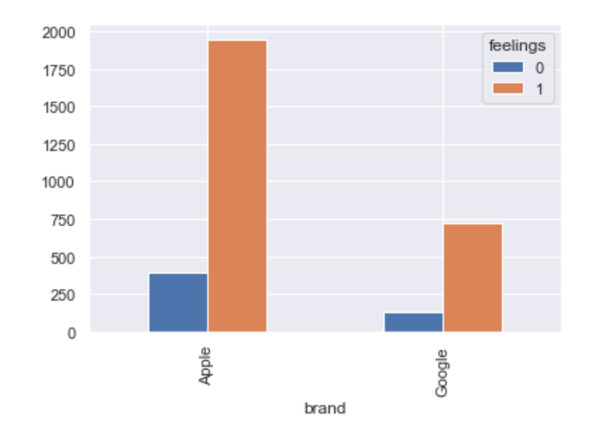
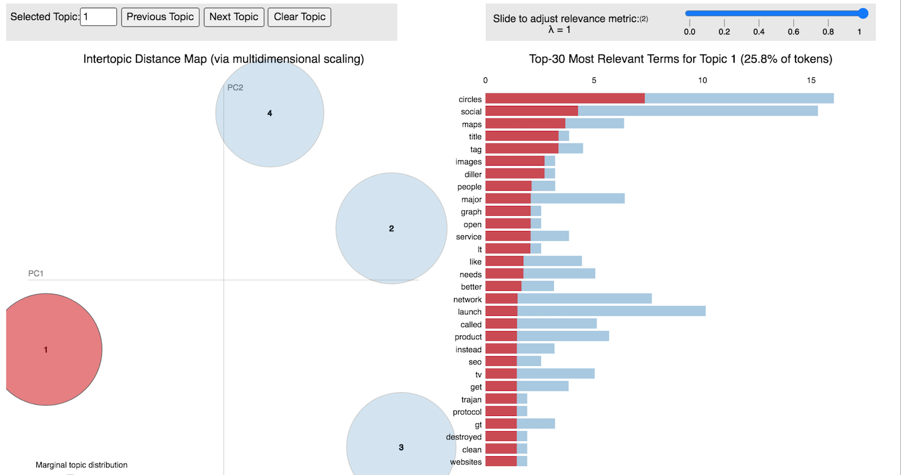
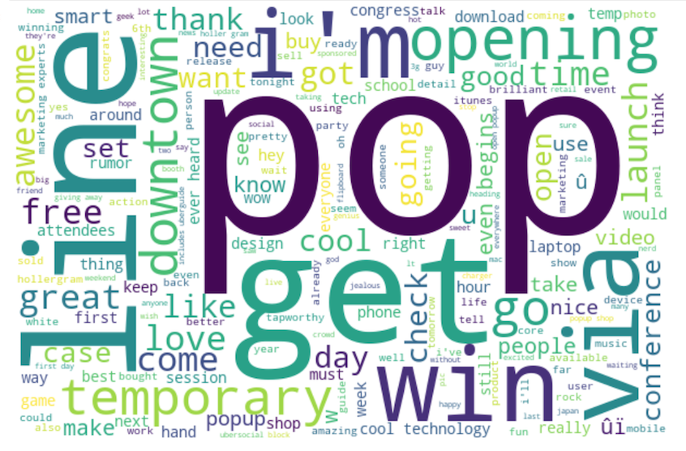

# Classifying Company & Product Sentiment Based on Tweets at a Tech Conference
Tim McAleer and Mark Patterson

## Introduction and Project Goals
We are MT Head Consulting, a consulting firm using the latest data science techniques to help companies improve their customer outreach. Using a database of 9,093 Tweets created at a 2011 SXSW Tech Conference, our challenge was to use Natural Language Processing to analyze messages people shared about Google and Apple products and services. These messages are the core of identifying customers' feelings; what they like and how companies can improve the customer's experience. Let's take a walk through the process and discuss the results.

## Clean and Shape the Data
The first steps are universal data cleaning processes. We took the 9,093 Tweets and checked for duplicates and missing values. The tweets had been previously binned and categorized, by crowd sourced judging, into positive, negative or neutral sentiments. The positive and negative tweets were further classified by whcih Google or Apple product the sentiment applied to. We took the 9 categories of products and reduced them to binary options, either Apple or Google. We also narrowed our scope by eliminating the neutral tweets, so our focus became positive and negative Tweets directed at Apple or Google. We end up with 3,548 Tweets that are perfect for our goal. Our decision is to analyze the positive Tweeters to find out what they like, and to specifically target our negative Tweeters to identify opportunities for improvement. This information is the lifeblood of our company. We use it to interpret and advise.

Class imbalance for each company.

## Natural Language Processing and Data Exploration
Our first steps to begin NLP are more cleanup. We tokenize our tweets and use Regex and stopword elimination to filter our data to its meaningful components. In plain terms, we eliminate words and symbols that don't add meaning. We also eliminate words that occur frequently like the name of the conference, and the top products mentioned. We then create visuals to interpret our data in its most basic form before we take steps to transform and model it. One method we use is to look at the words used throughout the entire set of tweets by frequency and create a word cloud to help visualize this. The image below shows the top 200 words in our set of all 3,548 tweets. 

## Classification Modeling
At this point, we have several decisions to make. 
- Do we use Count Vectorization (a method of counting words in a message to produce a value count) or TF-IDF (a method of weighting words to assign value by frequency in the overall data)? 
- Do we lemmatize (a method of transforming words into their root)?
- Do we SMOTE the minority class(where we create artificial data based on the minority class to address class imbalance)?
- And what classification model do we choose? 

Our answer is to use an iterative, layeerd approach (brute force). We pick three models we predict will have the best overall success, and run each combination of the above options and record each of the 24 results into a spreadsheet. Organization is necessary. Our interpretation of the results indicates our best model is Multinomial Naive Bayes using TF-IDF with lemmatization and SMOTE. Below we have highlighted the results and although the accuracy of this model is fairly high (0.83) we are concerned with the realtvely low recall (0.62)

## Topic Modeling
From our Random Forest model we extracted feature importances - which shows us the words in the tweets that help drive the model. But to go deeper, we use unsupervised modeling to explore relationshipis in our data. We use LDA, Latent Dirichlet Allocation, which is a method of "soft clustering." It takes in text data and processes it to vizualize relationships (topics) existing in the data without having to supply labels like "positive" or "negative." It will come to its conclusions without our help. From this, we can see how words will relate to each other (clusters) which will help us understand the data when we apply labels to it.

Finally, we split our data into four quadrants: first by company then by positive or negative. The simplest way is a word cloud. A striking visual with clear interpretaion, a word cloud is an effective tool to interpret words in terms of their strength of influence and importance to the subject. Creating four word clouds is a quick and easy way to compare and contrast and find results.

## Our Recommendations!
Our analysis focused on the negative Tweets of both companies. After all, our business is to find areas in which customer satisfaction is low and can be improved. 

### Overall recommendations for Google:
- Google Circles: Announced at that tech conference, was a misfire. Too much competition in that space.
- Google Maps: In 2011 navigation errors were still too common. One notable bug was sending people to Death Valley.
- Google Search: Microsoft Bing was still young and seen as strong competition.
- Google: Too much focus on unimportant matters. Stick to what you do best.

### Overall recommendations for Apple:
- iPhone: The small battery needs to be addressed.
- Apple News: Seen as boring and stale. Needs massive improvement to stay relevant.
- iPad 2 Launch: Long lines and poor customer service are hurting customer enthusiasm.

We also make the following suggestions for process improvement. 
- Dashboard Approach: the model should be tuned for speed and frequent reporting and a dashboard could provide this.
- Tweets: may not be the best source of actionable feedback, but it is good to include them as part of a mix. 
